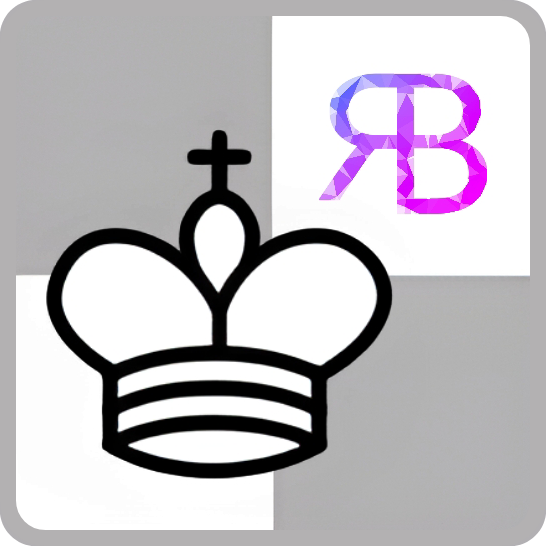
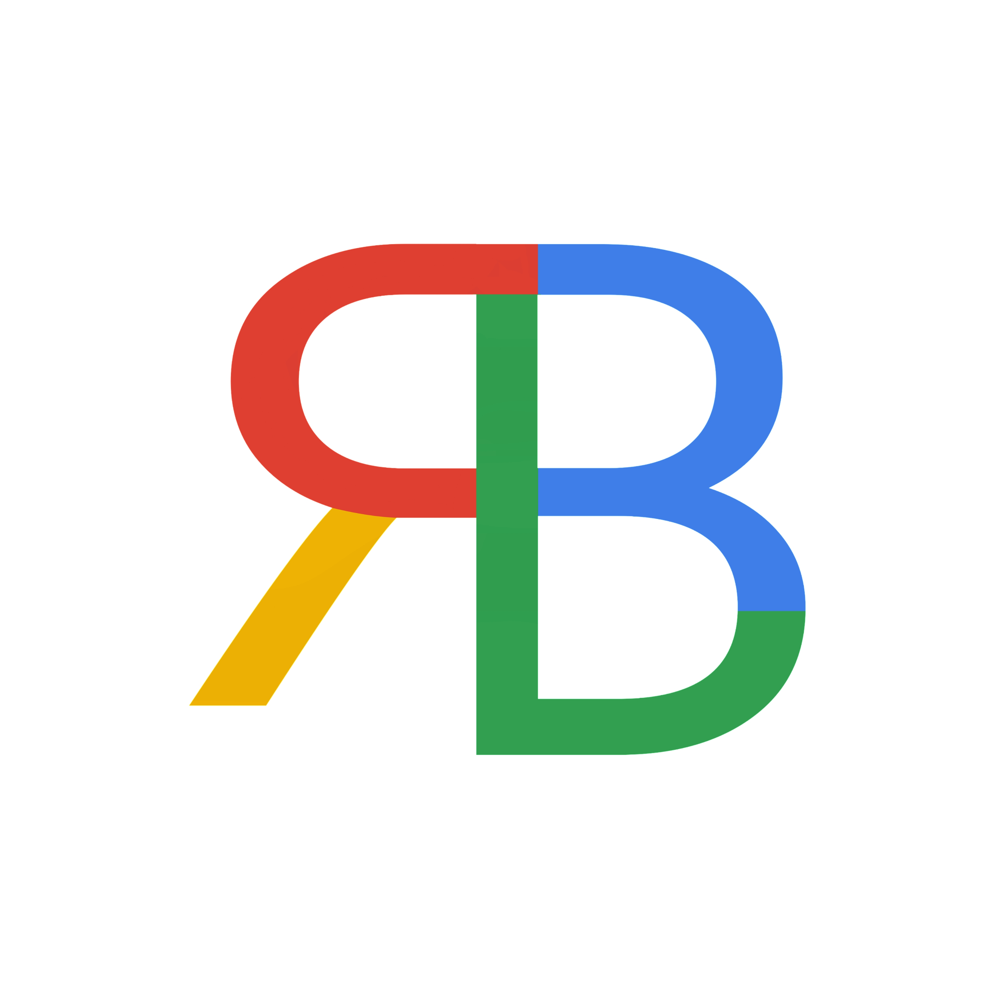

# Chess GUI

[](https://github.com/tterb/atomic-design-ui/blob/master/LICENSEs) [](https://app.netlify.com/sites/nielbrioneschessgui/deploys)

A fully-functional interface for loading and generating chess game files.

### Features

- Load/Import FEN file
- Download FEN file
- Download PGN file
- Animation speed setting
- Reset Board
- Rotate Board
- Auto highlight valid moves

<br />

This project is deployed on Netlify

[Browse Chess GUI](https://nielbrioneschessgui.netlify.app)

<br />

## Run Locally

**Clone the project**

```bash
  git clone https://github.com/scinth/Simple-Chess-GUI myproject
```

**Go to the project directory**

```bash
  cd myproject
```

**Install dependencies**

```bash
  npm install
```

**Start the server**

```bash
  npm run start
```

<br />

## Tech Stack

 &nbsp;
 &nbsp;
 &nbsp;
 &nbsp;


<br /><hr /><br />

For comments and suggestions, please reach out to me at<br/>
[ rodnielbriones@gmail.com](rodnielbriones@gmail.com)
